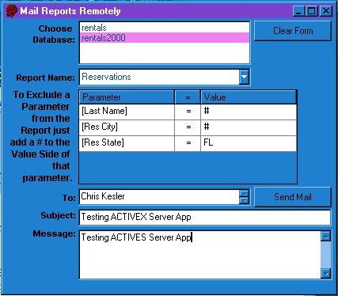



## DCOM Access Report Automation

### Description

This is an example of how to create an ActiveX EXE Server that does three things. 1) retrieves file listing of databases from the server directory, 2) retrieves a list of reports and then lets you retrieve the pre-defined parameters in that report and 3) allows you to fire off the report to a Word file in the server directory and then attach it to a MAPI Session and mail it. I have currently set it to MS Exchange Setting (hard coded), but you can change that to your own personal profile. This was put together in a limited amount of time so there is some spaghetti code involved as well as some untrapped errors, but I am still working on it. If you like it please vote on it and let me know if you like it and I will continue to clean up the code and release later versions in the future. A test Database is included (Rentals2000.mdb) which is an Access 2000 database, there is also an Access 97 Database included (Rentals.mdb). However, the code was created for Access 2000 due to the VBA library that was used. Good luck!
 
### More Info
 
Before debugging or adding to this code you must understand how to debug DCOM and COM Applications in order for this to be of any use to you.

The code is a little sloppy at this point and not all errors have been trapped, but it is functional and I had to put a timed pause in the process to work with some of out limitations here.

             |
---                |---
**Submitted On**   |2001-02-15 15:21:14
**By**             |[Chris Kesler](https://github.com/Planet-Source-Code/PSCIndex/blob/master/ByAuthor/chris-kesler.md)
**Level**          |Advanced
**User Rating**    |4.0 (40 globes from 10 users)
**Compatibility**  |VB 6\.0, VBA MS Access
**Category**       |[OLE/ COM/ DCOM/ Active\-X](https://github.com/Planet-Source-Code/PSCIndex/blob/master/ByCategory/ole-com-dcom-active-x__1-29.md)
**World**          |[Visual Basic](https://github.com/Planet-Source-Code/PSCIndex/blob/master/ByWorld/visual-basic.md)
**Archive File**   |[CODE\_UPLOAD150222152001\.zip](https://github.com/Planet-Source-Code/chris-kesler-dcom-access-report-automation__1-21040/archive/master.zip)

